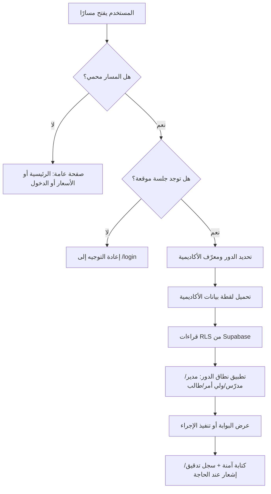

# تقرير تدقيق تشغيلي شامل — منصة MY Academy

**تاريخ اللقطة:** 13 أغسطس 2026
**إعداد:** Manus AI
**النطاق:** نسخة الإنتاج على `https://my-academy-eg.vercel.app`، والشيفرة الموجودة على فرع `main` في مستودع MY Academy.
**الغرض:** تمكين مالك المنصة من مراجعة ما الذي يحدث داخل الموقع عمليًا: المستخدمون، الصفحات، البيانات، الصلاحيات، المدفوعات، الدعم، الرسائل، الاختبارات، وما يزال يحتاج إلى تفعيل أو قرار تجاري.

> **مهم:** كلمة «شامل» في هذا التقرير تعني تغطية كل مجال وظيفي ومسار رئيسي ووحدة تشغيلية موجودة حاليًا، وليست نسخًا حرفيًا لكل سطر من الشيفرة. كل نتيجة مبنية على مراجعة الشيفرة، وسجل الاختبارات الحية، وسجل أخطاء الإنتاج حتى تاريخ اللقطة.

---

## 1. الخلاصة التنفيذية

MY Academy هي منصة SaaS لإدارة الأكاديميات التعليمية، مبنية لتشغيل أكثر من أكاديمية مع فصل بيانات كل أكاديمية عن الأخرى. يدعم المنتج أدوار **مدير الأكاديمية، المدرّس، ولي الأمر، الطالب، وصاحب المنصة**؛ ويجمع في دورة تشغيل واحدة إدارة الطلاب والمجموعات والحصص والحضور والدرجات والواجبات والمدفوعات والتواصل والدعم والتقارير والاشتراكات. تعتمد الواجهة العربية والاتجاه من اليمين إلى اليسار، وتستخدم الجنيه المصري في الخطط والمدفوعات. [1] [2]

| المحور | الحالة في لقطة التدقيق | ما يعنيه ذلك عمليًا |
|---|---|---|
| الوصول والأدوار | **يعمل ومختبَر** | كل دور يصل إلى بوابته، وتتحقق الحماية من فتح لوحة المدير مباشرةً بحساب المدرّس أو الطالب. |
| عزل الأكاديميات | **مطبّق بطبقتين** | قراءة الإنتاج تعتمد على RLS في Supabase، مع لقطة بيانات مرتبطة بالأكاديمية وفشل آمن عند غياب سياق الجلسة. |
| بيانات الطالب وولي الأمر | **يعمل ومختبَر** | لوحة الطالب وولي الأمر تعرضان بيانات السجل المرتبط؛ لا يظهر للطالب أو ولي الأمر مسار الإدارة. |
| الرسائل والدعم | **يعملان وظيفيًا** | مركز الرسائل يفتح بحالة فارغة سليمة عند غياب جهات اتصال، وتذاكر الدعم مقيدة بالأكاديمية/المستخدم. |
| الاشتراكات والمدفوعات | **جاهز برمجيًا، غير مفعّل تجاريًا** | توجد منطقية Stripe وPaymob والتحقق من webhook، لكن مفاتيح الإنتاج المطلوبة لم تُضف بعد. |
| WhatsApp | **محمي وغير مفعّل** | لا يرسل رسائل حقيقية بلا بيانات اعتماد؛ التفعيل متوقف على إعداد Meta والدفع/رقم الاختبار. |
| اللغة العربية | **مكتملة عمليًا** | الواجهات الأساسية والأرقام والتاريخ والعملات المشتركة عُرّبت؛ تم إصلاح العملة والصفحات المتبقية. |
| الاختبارات والنشر | **ناجحان في آخر تشغيل** | اجتازت TypeScript والبناء الإنتاجي ومجموعة اختبارات الواجهة، والنشر الأخير بحالة READY. |

المنصة مناسبة لتشغيل تجريبي منضبط ولبدء بيع اشتراكات بعد إتمام التفعيلات الخارجية الواردة في قسم **«ما يلزم من المالك قبل التشغيل التجاري»**. لا يُنصح باعتبارها جاهزة لتحصيل مدفوعات فعلية أو إرسال WhatsApp جماعي قبل توصيل مفاتيح Paymob/Stripe وMeta واختبار webhook ببيانات مزود حقيقية.

---

## 2. المعمارية: ماذا يحدث عند فتح الموقع؟

تعمل الواجهة باستخدام **Next.js 14 App Router** مع TypeScript وReact وTailwind. تتضمن الحزم طبقة Supabase للمصادقة والبيانات، Sentry للمراقبة، Redis/Upstash للحد من المحاولات، Resend للبريد، وWeb Push للتنبيهات، بالإضافة إلى Playwright للاختبارات الطرفية. [3]

عند فتح أي صفحة محمية، يتحقق غلاف التطبيق من وجود جلسة موقعة للمستخدم. إن لم توجد جلسة، يُعاد التوجيه إلى صفحة الدخول. وإن وُجدت، تُحمّل المنصة لقطة بيانات الأكاديمية الخاصة بهذا المستخدم قبل رسم الواجهة. هذه اللقطة مربوطة بمعرّف الأكاديمية فقط، ولا يوجد انتقال تلقائي إلى بيانات العرض أو إلى أكاديمية أخرى عند غياب السياق؛ بل تعود طبقة البيانات بحالة فارغة **بشكل آمن**. [4] [5]

### 2.1 تسجيل الدخول والجلسة

مسار تسجيل الدخول الفعلي هو `POST /api/auth/login`. في الإنتاج، يرفض الموقع الدخول إذا لم تكن Supabase مهيأة، ثم يطبق حدًا للمحاولات لمنع التخمين المتكرر لكلمات المرور. عند نجاح الدخول، تُنشئ Supabase كوكيز المصادقة اللازمة لتطبيق RLS، وتصدر المنصة أيضًا كوكي `ma_session` موقّعًا يحمل هوية المستخدم ودوره وأكاديميته. مصدر تفويض المستخدم هو عضوية أكاديمية **نشطة**؛ ويُفضّل الربط المطابق لـ`profile.academy_id` ثم يختار عضوية نشطة فقط، وليس «أول أكاديمية» بشكل غير آمن. [6]

| مرحلة الدخول | السلوك | حماية مهمة |
|---|---|---|
| إدخال البريد وكلمة المرور | يرسل العميل طلبًا إلى مسار الدخول. | التحقق من الحقول وإعادة خطأ 400 عند النقص. |
| مقاومة التخمين | تُطبّق حدود المحاولات في بيئة الإنتاج. | إيقاف مؤقت عند تجاوز الحد بدل قبول طلبات غير محدودة. |
| مصادقة Supabase | `signInWithPassword` ينشئ جلسة Supabase. | تعتمد قراءات RLS اللاحقة على جلسة المستخدم. |
| تحديد العضوية | يجلب الملف الشخصي والعضويات النشطة. | يمنع المستخدم غير المرتبط بأكاديمية نشطة من المتابعة. |
| إنشاء جلسة التطبيق | كوكي HttpOnly وSameSite=Lax وSecure في الإنتاج. | الكوكي لا يصل إلى JavaScript في المتصفح. |
| توجيه بعد الدخول | يفتح المستخدم الصفحة الرئيسية الملائمة لدوره. | لا تتحدد الصلاحية من رابط يكتبه المستخدم يدويًا. |

### 2.2 الجلسة التجريبية مقابل الإنتاج

يوجد مسار بيانات عرض محلي لتشغيل الواجهة والاختبارات دون أسرار. هذا المسار لا يُسمح به على الإنتاج إلا عندما يكون علم اختبارات E2E الصريح مفعّلًا؛ أما الإنتاج العادي فيتطلب Supabase. لذلك لا ينبغي اعتبار بيانات العرض التجريبية نموذجًا لآلية المصادقة الفعلية في الاستخدام المدفوع. [5] [6]

---

## 3. الأدوار: من يرى ماذا، ومن يستطيع فعل ماذا؟

طبقة `requireRole` تتحقق من الدور قبل رسم الصفحة، وتُعيد المستخدم إلى صفحته الرئيسية إذا حاول فتح مسار لا يخصه. يملك `SUPER_ADMIN` صلاحية عرض أوسع لإدارة المنصة، بينما يعتمد كل دور تشغيلي على نطاق بيانات الأكاديمية والجداول المرتبطة به. [5]

| الدور | البوابة الرئيسية | نطاق القراءة | أهم العمليات المتاحة | ما جرى اختباره حيًا |
|---|---|---|---|---|
| **مدير الأكاديمية** | `/dashboard` | جميع بيانات أكاديميته فقط. | إدارة الطلاب وأولياء الأمور والمدرسين والمجموعات والحصص والحضور والدرجات والمدفوعات والتقارير والإعدادات والدعم. | فتح لوحة التحكم، الطلاب، المجموعات، الإعدادات، الدعم، الخصوصية والرسائل. |
| **المدرّس** | `/teacher` | المجموعات المسندة إليه أو التي يساعد فيها، وطلاب تلك المجموعات. | متابعة الحصص، تسجيل الحضور، إدخال الدرجات، مراجعة الواجبات، المساعدون. | فتح البوابة ومركز المساعدة؛ محاولة `/dashboard` أعادته إلى بوابته. |
| **ولي الأمر** | `/parent` | الأبناء المرتبطون به فقط. | عرض حضور الأبناء ودرجاتهم وواجباتهم وحصصهم ومدفوعاتهم وتقاريرهم. | فتح البوابة والبيانات المالية ومسارات الأبناء. |
| **الطالب** | `/student` | السجل الطالب المرتبط بالبريد والجداول المسموح بها له. | مشاهدة الحصص والتقدم والدرجات والواجبات والحضور. | فتح البوابة؛ محاولة `/dashboard` أعادته إلى بوابته. |
| **صاحب المنصة** | `/platform` | بيانات SaaS والمنصة حسب صلاحية SUPER_ADMIN. | متابعة الأكاديميات والخطط والنمو والاستخدام. | راجعت الشيفرة والمسار؛ لا يدخل هذا الدور ضمن حسابات العرض الأربعة. |

### 3.1 نطاق المدرّس

لا يعتمد تقييد المدرّس على إخفاء الأزرار فقط. ينشئ النظام مجموعة من معرفات المجموعات التي يملكها المدرّس أو يعمل مساعدًا فيها، ثم يستخرج الطلاب المسجلين في تلك المجموعات. بهذا لا ينبغي أن تتسع عمليات حضور أو واجبات أو درجات المدرّس لتشمل مجموعة خارج نطاقه. [7]

### 3.2 نطاق ولي الأمر والطالب

ولي الأمر يُحل إلى سجل `parents` المطابق للملف/البريد، ثم يستخرج الأبناء الذين يحملون `parent_id` نفسه وغير مؤرشفين. الطالب يُحل إلى سجل الطالب المرتبط ببريده، ثم تُشتق مجموعاته وحصصه ودرجاته وواجباته من علاقاته المسجلة. تحسب البوابة الحضور والمتوسط والمستحق والمتبقي والواجبات من الجداول المسموح للمستخدم بقراءتها. [8]

> **قاعدة تشغيلية:** لا يوجد في منطق البوابة اختيار حر لطالب آخر من رابط أو قيمة نموذج. كل لوحة تبدأ من هوية الجلسة، ثم من العلاقة المخزنة بين المستخدم وسجل الطالب/ولي الأمر/المدرّس.

---

## 4. خريطة صفحات الموقع ووظيفة كل مجموعة

الجداول التالية تسرد جميع مجموعات المسارات الموجودة في التطبيق وقت المراجعة. المسارات الديناميكية مثل `[id]` تعني أن الصفحة تفتح سجلًا محددًا، وليست صفحة عامة مستقلة.

### 4.1 الصفحات العامة ومسارات الدخول

| المسار | ماذا يفعل | ملاحظات تشغيلية |
|---|---|---|
| `/` | صفحة التسويق الرئيسية. | نقطة دخول عامة للمنتج.
| `/pricing` | عرض خطط وأسعار المنصة بالجنيه المصري. | الخطط موجودة برمجيًا وتُعرض بالعربية. |
| `/login` | دخول المستخدمين. | يستخدم API المصادقة وحد المحاولات. |
| `/signup` | إنشاء/بدء حساب جديد. | يرتبط بمسار تهيئة الأكاديمية. |
| `/forgot-password` | بدء استعادة كلمة المرور. | يتطلب تكامل بريد فعلي لإرسال الروابط في الإنتاج. |
| `/invite/[token]` | قبول دعوة آمنة. | الرمز يحدد الانضمام والدور ولا يُفترض مشاركته. |
| `/checkin` | نقطة تحقق/تسجيل حضور عامة بحسب جلسة/QR. | تكملها مسارات API للحضور وQR. |

### 4.2 إدارة الأكاديمية للمدير

| المجموعة | المسارات | ما يجري داخلها |
|---|---|---|
| لوحة المتابعة | `/dashboard`, `/analytics`, `/reports`, `/calendar` | مؤشرات الأداء، الرسوم، النمو، الدخل، الحضور، التقارير وجدول العمل. |
| الطلاب والأهالي | `/students`, `/students/[id]`, `/students/[id]/report`, `/students/import`, `/parents/[id]` | إنشاء وتعديل الطلاب، الملف الشامل، التقرير الفردي، الاستيراد من CSV، وبيانات ولي الأمر. |
| الدراسة | `/groups`, `/groups/[id]`, `/lessons`, `/lessons/new`, `/lessons/[id]`, `/attendance`, `/attendance/scan`, `/grades`, `/grades/[id]`, `/homework`, `/homework/[id]` | الدورات والمجموعات والحصص والحضور والدرجات والواجبات. |
| المال والتواصل | `/payments`, `/billing`, `/messages`, `/notifications` | تحصيل ومتابعة رسوم الطلاب، ترقية خطة الأكاديمية، مراسلات داخلية، وتنبيهات. |
| الإدارة والحوكمة | `/onboarding`, `/settings`, `/audit`, `/privacy`, `/terms`, `/support`, `/help` | التهيئة الأولى، إعدادات الأكاديمية، سجل النشاط، الخصوصية، الشروط، الدعم والمساعدة. |

### 4.3 بوابات الدور

| البوابة | المسارات الفرعية | القيمة للمستخدم |
|---|---|---|
| المدرّس | `/teacher`, `/teacher/assistants` | ملخص المجموعات والطلاب والحصص القادمة والحضور المطلوب والواجبات التي تحتاج مراجعة وإدارة المساعدين. |
| ولي الأمر | `/parent`, `/parent/children`, `/parent/children/[id]`, `/parent/children/[id]/report`, `/parent/attendance`, `/parent/grades`, `/parent/homework`, `/parent/payments` | صورة مفهومة عن كل ابن/ابنة: حضور ودرجات وواجبات وحصص ومدفوعات وتقارير. |
| الطالب | `/student`, `/student/classes`, `/student/lessons`, `/student/grades`, `/student/homework`, `/student/progress` | واجهة تعلم شخصية للحصص والتقدم والنتائج والواجبات. |

### 4.4 واجهات API والتشغيل الخلفي

| المسار الخلفي | الغرض | ملاحظة أمان/تشغيل |
|---|---|---|
| `/api/auth/login` | الدخول وإصدار الجلسة. | حد محاولات وتحقق Supabase/العضوية. |
| `/api/attendance`, `/api/checkin`, `/api/qr-session` | عمليات الحضور والتحقق وQR. | لا يغني QR عن التحقق من الجلسة والنطاق. |
| `/api/export` | تصدير بيانات الخصوصية. | يحتاج مراجعة حساب المالك/المستخدم الذي يطلب التصدير. |
| `/api/search` | البحث داخل البيانات المسموح بها. | يجب أن يبقى مقيدًا بسياق الأكاديمية والدور. |
| `/api/push/subscribe`, `/api/push/send` | اشتراك وإرسال تنبيهات Push. | لا تستخدمه قبل ضبط مفاتيح Push وسياسة موافقة. |
| `/api/billing/stripe/webhook`, `/api/billing/paymob/webhook` | استقبال نتائج الدفع. | لا يُفعّل الاشتراك إلا بعد تحقق callback صحيح. |
| `/api/webhooks/whatsapp`, `/api/whatsapp/test` | Webhook واختبار WhatsApp Cloud API. | لا يعمل الإرسال الحقيقي بلا أسرار/رقم معتمد. |
| `/api/health` | فحص صحة التطبيق. | مناسب للمراقبة الخارجية بعد الإطلاق. |

خريطة المسارات أعلاه مأخوذة من جرد التطبيق الفعلي، وليس من قائمة أفكار مستقبلية. [1]

---

## 5. دورة العمل داخل الأكاديمية

### 5.1 بدء أكاديمية جديدة

يبدأ المدير من التسجيل ثم إعداد الأكاديمية وإدخال الهوية الأساسية. يمكنه دعوة المدرسين، ثم إنشاء المجموعات بعد توفر مدرس صالح، وإضافة الطلاب يدويًا أو عبر CSV. جرى تعديل التهيئة حتى لا ترسل المنصة معرف مدرس فارغ إلى قاعدة البيانات عند إنشاء مجموعة أولى؛ بدلاً من ذلك تُؤجل المجموعة إلى أن تُقبل دعوة المدرّس. هذا يحافظ على صحة علاقات الحضور والدرجات ولا يضع سجلاً مكسورًا في قاعدة البيانات. [9]

### 5.2 إدارة اليوم الدراسي

بعد تهيئة الأكاديمية، ينشئ المدير المجموعات والحصص والطلاب وربط الطلاب بالمجموعات. يملك المدرّس رؤية للمجموعات المسندة إليه، ويسجل حضور الحصة ويعمل على الدرجات والواجبات. تُبنى صفحة المدير على مؤشرات من الطلاب والمجموعات والحصص والحضور والدرجات والمدفوعات والواجبات، بينما تتلقى بوابات الطالب وولي الأمر ملخصات مصغرة خاصة بها. [7] [8]

### 5.3 الحسابات والرسوم

يحمل سجل الدفع المبلغ المطلوب والمدفوع، ثم تشتق المنصة المتبقي والحالة: `PAID` عند السداد الكامل، و`PARTIAL` عند السداد الجزئي، و`UNPAID` خلاف ذلك. هذا الحساب يمنع الاعتماد على قيمة حالة يدوية غير متوافقة مع الأرقام. [7]

### 5.4 التواصل والدعم

يستخدم مركز الرسائل رسائل مخزنة مرتبطة بمعرف المرسل والمستلم؛ ولا تُخزن أسماء الواجهة كأعمدة إضافية في جدول الرسائل. عند التحميل، تُشتق أسماء العرض من ملفات المستخدمين داخل نفس لقطة الأكاديمية. يدعم مركز الدعم إنشاء تذكرة بموضوع ووصف، ويرى المدير تذاكر الأكاديمية بينما يرى بقية الأدوار تذاكرهم هم فقط. [5] [10]

---

## 6. البيانات والعزل متعدد المستأجرين

### 6.1 الكيانات الرئيسية

| الكيان | أمثلة استخدامه | علاقاته الأساسية |
|---|---|---|
| `academies` | هوية الأكاديمية وإعداداتها. | مركز جميع بيانات المستأجر. |
| `profiles` و`academy_memberships` | هوية المستخدم ودوره وعضويته النشطة. | تحدد جلسة التطبيق والأكاديمية. |
| `students`, `parents`, `teachers` | ملفات الأشخاص التشغيلية. | الطالب يرتبط بولي أمر، والمدرّس بالمجموعات. |
| `courses`, `groups`, `group_students`, `group_assistants` | البنية الأكاديمية. | تربط الدورة والمجموعة والطلاب والمدرسين/المساعدين. |
| `lessons`, `attendance` | الحصص وسجل الحضور. | الحضور يتبع حصة وطالبًا. |
| `exams`, `grades` | التقييم والنتيجة. | الدرجة تتبع اختبارًا وطالبًا. |
| `homework`, `homework_submissions` | التكليفات والتسليم. | التسليم يتبع واجبًا وطالبًا. |
| `payments`, `payment_transactions` | رسوم الطلاب وحركاتها. | الحركة تتبع سجل دفع. |
| `messages`, `notifications`, `audit_logs` | التواصل والأثر التشغيلي. | مقيدة بالأكاديمية والمستخدم عند الاقتضاء. |
| `subscriptions`, `billing_events` | خطة SaaS وأحداث بوابات الدفع. | اشتراك واحد/حالة لكل أكاديمية. |
| `support_tickets` | الدعم داخل التطبيق. | مقيدة بالأكاديمية ومنشئ التذكرة. |

### 6.2 كيف يُمنع تسرب البيانات بين الأكاديميات؟

توجد طبقتان متكاملتان. الأولى هي **RLS في Supabase**: القراءات الإنتاجية التي تمر عبر جلسة المستخدم تستدعي `select` ثم تقيدها سياسة قاعدة البيانات. الثانية هي طبقة تطبيقية: تطلب `currentAcademyId` من الجلسة، وتحمّل فقط سجل الأكاديمية والجداول المفلترة بـ`academy_id` أو بأبناء العلاقات التابعة لها. [4] [7]

تتعمد الدالة `collections()` الإخفاق المغلق: إذا كانت Supabase مهيأة لكن الطلب لا يحمل أكاديمية مصادق عليها أو لم يتم تحميل لقطة الأكاديمية، فإنها تعيد بيانات فارغة بدلًا من بيانات العرض أو بيانات أكاديمية مخزنة من طلب سابق. هذه نقطة مهمة جدًا في أي SaaS متعدد العملاء. [5]

### 6.3 الكتابة إلى قاعدة البيانات

عمليات الإدراج والتحديث والحذف تستخدم طبقة write-through. بعد مشاكل قديمة في عمليات كتابة صامتة، أصبحت الأخطاء تسجل بوضوح. كما أضيف حاجز UUID يمنع معرفات بيانات العرض السهلة مثل `academy-1` من المرور إلى أعمدة UUID في الإنتاج. هذا ليس مجرد تحسين عرض؛ بل يمنع سلوكًا قد يخلق أخطاء كتابة أو يلوث سجلات التدقيق. [5] [9]

> **لا يوجد تغيير لقاعدة البيانات ضمن آخر حزمة إصلاح أخطاء.** كانت المعالجة متوافقة مع المخطط الحالي، ولم تُضف هجرة غير مطبقة. [9]

---

## 7. نموذج الاشتراك والتسعير

هذه الحدود معرفة في الشيفرة ومطبقة خادميًا عند محاولة إنشاء طلاب أو مدرسين أو مجموعات؛ ليست مجرد كلام ظاهر في صفحة الأسعار. [11]

| الخطة | السعر الشهري | الطلاب | المدرسون | المجموعات | الأكاديميات | التخزين |
|---|---:|---:|---:|---:|---:|---:|
| مجاني | ٠ ج.م. | 50 | 3 | 5 | 1 | 250 ميجابايت |
| أساسي | 399 ج.م. | 200 | 10 | 25 | 1 | 2 جيجابايت |
| احترافي | 899 ج.م. | 750 | 35 | 100 | 3 | 10 جيجابايت |
| مؤسسات | 2,499 ج.م. | 5,000 | 200 | 500 | 10 | 50 جيجابايت |

إذا لم يوجد اشتراك للأكاديمية، تُعامل الخطة المجانية كافتراضية في منطق التطبيق. وظيفة `canCreate` تقارن الاستخدام الحالي بالحد قبل الإضافة. ومع ذلك، تحتاج آلية تغيير الخطة وربطها بالدفع الحقيقي إلى مفاتيح مزود دفع صالحة وwebhook مفعل كما يلي. [11]

---

## 8. المدفوعات: Stripe وPaymob

يوفر النظام بوابة checkout مستضافة: يختار Stripe إن كانت `STRIPE_SECRET_KEY` موجودة، وإلا ينتقل إلى Paymob إن كانت `PAYMOB_SECRET_KEY` موجودة؛ وإن لم يوجد أي منهما تظهر رسالة بأن بوابة الدفع غير مربوطة. الأسعار تدفع بـEGP، وتُرسل بيانات الأكاديمية والخطة في metadata/extras لكي يعرف webhook أي اشتراك يجب تحديثه. [12]

الأمر الأكثر أهمية هو أن **بدء checkout لا يفعّل الخطة المدفوعة**. يحفظ النظام حدثًا تدقيقيًا، ولا يغيّر الاشتراك إلى `active` إلا بعد أن يستقبل callback ناجحًا تم التحقق منه. يوجد أيضًا تحقق HMAC لـPaymob باستخدام ترتيب الحقول المحدد في إعدادات لوحة Paymob ومقارنة آمنة زمنيًا. [12]

| ما هو جاهز | ما يحتاجه المالك | خطر عدم استكماله |
|---|---|---|
| منطق إنشاء Stripe Checkout. | `STRIPE_SECRET_KEY` وURL إنتاج HTTPS وإعداد webhook. | زر الترقية لن يبدأ دفعًا فعليًا. |
| منطق Paymob Intention وcallback/HMAC. | `PAYMOB_SECRET_KEY`, `PAYMOB_HMAC_SECRET`, `PAYMOB_PAYMENT_METHODS`, قالب checkout، هاتف ومدينة الفوترة. | Paymob يرفض إنشاء النية أو لا يمكن التحقق من callback. |
| تفعيل الاشتراك بعد callback متحقق فقط. | اختبار سيناريو نجاح وإلغاء وإعادة إرسال webhook في حساب اختبار. | خطر تفعيل/عدم تفعيل اشتراك بدون اختبار تكاملي. |

---

## 9. WhatsApp والبريد والإشعارات

### 9.1 WhatsApp Cloud API

خدمة WhatsApp مصممة لتبقى في وضع آمن عندما تكون بيانات الاعتماد غائبة. نتائج الاختبار السابقة أثبتت أن الخطأ الحالي مرتبط بحساب Meta أو وسيلة الدفع أو رقم الاختبار، لا بمسار يعمل على إرسال رسائل حية خفية. لا يجب تعطيل هذا الحاجز أو استخدام token تجريبي لمراسلة عملاء حقيقيين. [9] [13]

متغيرات الإنتاج التي يلزم إعدادها للتفعيل هي: `WHATSAPP_TOKEN`، و`WHATSAPP_WEBHOOK_VERIFY_TOKEN`، و`WHATSAPP_PHONE_NUMBER_ID`، و`WHATSAPP_APP_SECRET`. كما يلزم ربط webhook مع عنوان المنصة وإنهاء إعداد Meta Business/الدفع ورقم الإرسال. [13]

### 9.2 البريد والتنبيهات

تتضمن المنصة Resend لإرسال البريد وواجهات Push للاشتراك والإرسال. وجود المسارات لا يعني أن التنبيهات خرجت بالفعل إلى مستخدمين حقيقيين؛ يجب إضافة مفاتيح Resend ومفاتيح Push، ثم اختبار موافقة المستخدم والمتصفح وإلغاء الموافقة وسجل التسليم قبل الاعتماد عليها كقناة تشغيلية. [3] [1]

---

## 10. الخصوصية والدعم والحوكمة

توجد صفحة خصوصية ومسار تصدير، وصفحة شروط، وسجل تدقيق، ومركز دعم داخل التطبيق. تعمل تذاكر الدعم في نموذج مقيد بالأكاديمية: المدير يرى تذاكر أكاديميته، بينما الأدوار الأخرى ترى تذاكر أنشأوها هم فقط. [1] [10]

| الوظيفة | ماذا ينبغي أن يراجع المدير دوريًا |
|---|---|
| تصدير البيانات | من يطلب التصدير، ما الذي يدخل في الملف، وأين يحفظ بعد التنزيل. |
| سجل التدقيق | تغييرات الطلاب والدرجات والمدفوعات والإعدادات ودعوات المستخدمين. |
| تذاكر الدعم | زمن الرد، التذاكر المتكررة، وتصنيف العيوب مقابل طلبات الميزة. |
| الشروط والخصوصية | مراجعة الاسم القانوني للأكاديمية، بيانات التواصل، وفترات الاحتفاظ بالبيانات قبل التوسع. |

لا يمثل وجود صفحة الخصوصية وحده استشارة قانونية أو امتثالًا نهائيًا؛ يجب مراجعتها من محامٍ مصري عند تحويل المنصة إلى خدمة مدفوعة عامة أو عند تخزين بيانات حساسة على نطاق واسع.

---

## 11. ما تم اختباره فعليًا

### 11.1 اختبار الأدوار الحي

تم الدخول بحسابات العرض المستقلة، وليس بتبديل النص في الواجهة فقط. أظهر الفحص الحي أن المدير يصل إلى لوحة التحكم والطلاب والمجموعات والإعدادات والدعم والخصوصية، والمدرّس لا يحصل على لوحة المدير عند فتح رابطها، والطالب لا يحصل على لوحة المدير، وولي الأمر يرى بوابته وبيانات طفله/أطفاله. ظهرت العملة في بطاقة ولي الأمر بالشكل العربي `٠ ج.م.` بعد نشر إصلاح التنسيق. [14]

| الاختبار | النتيجة | حدود الاختبار |
|---|---|---|
| المدير: لوحة التحكم/الطلاب/المجموعات | ناجح. | لم ينشئ سجلات عملاء جديدة أثناء الاختبار الحي. |
| المدرّس: البوابة والحماية من `/dashboard` | ناجح. | بيانات العرض لا تحتوي بالضرورة على كل سيناريو حضور/واجب مكتمل. |
| الطالب: البوابة والحماية من `/dashboard` | ناجح بعد إعادة التحقق. | تم التحقق من حساب الطالب التجريبي فقط. |
| ولي الأمر: البوابة والعملة ومسارات الأبناء | ناجح. | لم يُرسل تذكير دفع حقيقي. |
| الخصوصية والدعم | فتحا بنجاح. | لم تُنشأ تذكرة جديدة كي لا تُلوّث بيانات العرض. |
| الأسعار | عربية وبالجنيه المصري. | لا تعني أن التحصيل الحقيقي مفعّل. |

### 11.2 الاختبارات الآلية والبناء

تشمل مجموعة E2E ملفات مستقلة لرحلات المدير وولي الأمر والطالب والمدرّس والأمان وwebhook للفوترة. في آخر حزمة إصلاحات، اجتازت فحوص TypeScript والبناء الإنتاجي ومجموعة اختبارات الواجهة الكاملة؛ كما اجتاز اختبار فتح صفحة الإعدادات المحدد بعد إصلاحها. [1] [9]

### 11.3 إصلاحات أخطاء الإنتاج الأخيرة

| العيب المرصود | السبب | الإصلاح | التحقق النهائي |
|---|---|---|---|
| سجل التدقيق استقبل `academy-1` بدل UUID. | انتقال معرف عرض إلى طبقة كتابة الإنتاج. | حاجز يمنع المعرف غير المطابق لـUUID من الإدراج. | أضيف إلى حزمة `9992c5d`. |
| `messages.recipient_name` غير موجود. | إرسال أعمدة واجهة ليست ضمن مخطط جدول الرسائل. | حفظ أعمدة المخطط فقط واشتقاق الأسماء عند القراءة. | مركز الرسائل فتح بلا خطأ. |
| UUID فارغ عند إنشاء مجموعة أثناء التهيئة. | محاولة إنشاء مجموعة بلا مدرس معين. | تأجيل إنشاء المجموعة حتى قبول دعوة مدرس. | متوافق مع قيد قاعدة البيانات الحالي. |
| تعطل `/settings` برقم Digest. | سباق بين رسم المكوّن وتحميل لقطة الأكاديمية. | استخدام `await requireScopedRole("ADMIN")` قبل القراءة. | فُتحت الإعدادات على الإنتاج بلا استثناء. |
| أخطاء قديمة في `/parent` و`/parent/children`. | نشر قديم وقراءات اختيارية غير محمية. | تحقق حي من السلوك الحالي؛ لا تغيير تخميني. | المساران يعملان في النشر الحالي. |

سجل الخطأ يبين أن خطأ إعدادات المدير ظهر بعد إصلاحات أولية، ثم عولج في الالتزام `598830398a940cf358270727af84e1189f5beb0a`، وأكد الفحص الحي أن مجموعة الأخطاء المتبقية كانت تاريخية من نشر سابق وليست من النشر الحالي. [9]

---

## 12. ما لا يزال غير مفعّل أو يحتاج قرارًا من المالك

| الأولوية | البند | الحالة الحالية | الإجراء المطلوب | مسؤول التنفيذ |
|---:|---|---|---|---|
| حرجة | إلغاء GitHub PAT المكشوف سابقًا. | خطر أمني إذا ظل الرمز صالحًا. | إلغاء الرمز فورًا من صفحة GitHub Tokens، ثم إنشاء رمز جديد عند الحاجة بأقل صلاحيات. | المالك. |
| حرجة قبل تحصيل المال | Paymob أو Stripe. | الشيفرة جاهزة؛ الأسرار غير مؤكدة في الإنتاج. | إضافة المفاتيح، URL HTTPS، webhook، وتنفيذ دفعة اختبار/إلغاء/تكرار webhook. | المالك + المطوّر. |
| حرجة قبل رسائل فعلية | WhatsApp Cloud API. | محمي وغير نشط؛ إعداد Meta عالق بسبب خطأ دفع/اختبار. | إكمال Meta Business والدفع/الرقم، ثم إضافة المتغيرات الأربعة واختبار opt-in. | المالك. |
| عالية | البريد عبر Resend. | التكامل موجود لكن المفتاح لا يزال مطلوبًا. | إضافة `RESEND_API_KEY` وضبط نطاق الإرسال واختبار دعوة واستعادة كلمة مرور. | المالك. |
| عالية | رابط WhatsApp للمبيعات. | يعتمد على متغير عام. | ضبط `NEXT_PUBLIC_WHATSAPP_SALES_URL` برقم مبيعات رسمي وسياسة رد. | المالك. |
| عالية | مراجعة قانونية. | توجد صفحات شروط وخصوصية. | مراجعة محامٍ محلي للبيانات والقُصّر والفواتير والاشتراكات. | المالك/المستشار القانوني. |
| متوسطة | مراقبة تشغيل مستمرة. | تتوفر health وسجلات نشر/أخطاء. | إضافة تنبيه عند فشل `/api/health` وتتبع أخطاء Sentry/الاستضافة. | المطوّر/التشغيل. |
| متوسطة | نسخ احتياطي وتجربة استعادة. | تحتاج سياسة عملية لا افتراضًا. | جدولة نسخة واختبار استعادة على مشروع/بيئة آمنة قبل زيادة العملاء. | المالك/التشغيل. |

### 12.1 تنبيه أمني بخصوص الرمز المكشوف

يجب التعامل مع أي Personal Access Token ظهر في محادثة أو لقطة شاشة كأنه تم كشفه، حتى لو لم يستخدمه أحد. الإجراء الصحيح هو **إلغاؤه لا تغييره نصيًا فقط**، ثم إنشاء رمز بديل محدود الصلاحيات عند الحاجة. لا يوضع أي رمز في كود المتصفح أو ملفات Git التي يمكن رفعها.

---

## 13. إجراءات تشغيل مقترحة بعد المراجعة

### قبل أول عميل مدفوع

ابدأ بإلغاء الرمز المكشوف، ثم إعداد بوابة دفع واحدة فقط في البداية — Paymob قد يكون الأنسب للسوق المصري — واختبر اشتراكًا قصيرًا أو حساب اختبار. بعد نجاح callback، تأكد أن الخطة تغيرت مرة واحدة فقط عند إعادة إرسال webhook، وأن الإلغاء لا يمنع العميل من الوصول قبل انتهاء الفترة المدفوعة.

بعد ذلك فعّل Resend لإرسال الدعوات واستعادة كلمة المرور. لا تفعل WhatsApp كقناة جماعية قبل توثيق موافقة العملاء وقواعد إلغاء الاشتراك؛ ابدأ بقالب واحد لتأكيد الدفع أو تذكير الحصة واختبره على رقم داخلي.

### خلال أول شهر تشغيل

أنشئ أكاديميتين اختباريتين بحسابين منفصلين، وأعد تشغيل اختبارات العزل: حاول فتح رابط طالب من أكاديمية A باستخدام مدير أو مدرس من B، وتأكد أن النتيجة رفض أو صفحة غير موجودة، وليس بيانات الطرف الآخر. راجع سجل التدقيق أسبوعيًا، وراقب تذاكر الدعم ورسائل الفشل في الاستضافة.

### قبل التوسع التسويقي

شغّل اختبارًا يدويًا كاملًا بدور كل عميل حقيقي، ثم راجع النسخ الاحتياطي والاستعادة، وضبط صفحات الشروط والخصوصية ببيانات الشركة الحقيقية، وأنشئ قناة دعم ومبيعات رسمية. اجعل العملاء يشاهدون بوضوح ما يحصلون عليه في كل خطة وما يحدث عند تجاوز الحد.

---

## 14. سجل الإصدارات ذات الصلة بهذه المراجعة

| الالتزام | الغرض | الأثر التشغيلي |
|---|---|---|
| `c97cd92` | حزمة النمو التجاري والدعم. | دعم/خصوصية/خطط وخصائص SaaS. |
| `941d6dc` و`29522b0` و`a69fa8b` | التعريب والتحويل إلى صيغ عربية مشتركة. | توحيد العربية والعملة والترقيم في الواجهة. |
| `9992c5d` | تقوية التهيئة وكتابات بيانات الإنتاج. | معالجة UUID وسجل التدقيق والرسائل ومجموعة التهيئة. |
| `5988303` | تحميل الأكاديمية قبل عرض الإعدادات. | معالجة عطل `/settings` في الإنتاج. |
| `2f4a3ce` | توثيق التحقق من معالجة أخطاء التشغيل. | دليل تدقيقي على نتيجة الاختبار والنشر. |

---

## 15. الحكم النهائي للمراجعة

**الوضع الحالي جيد تقنيًا للتجربة والإدارة التشغيلية، مع حماية أدوار وعزل بيانات واضحين في الشيفرة وفحص حي ناجح لأدوار العرض.** جرى إصلاح الأخطاء البرمجية التي ظهرت في سجلات الإنتاج خلال دورة المراجعة الأخيرة، وأعيد التحقق من الإعدادات والرسائل بعد النشر.

الفرق بين «جاهز للتجربة» و«جاهز لإيراد متكرر» ليس في واجهة الموقع الآن، بل في التفعيلات الخارجية والانضباط التشغيلي: الدفع، WhatsApp، البريد، إدارة المفاتيح، النسخ الاحتياطي، والسياسة القانونية. عند تنفيذ العناصر الحرجة في القسم 12 واختبارها بحسابات مزودين حقيقية، تصبح المنصة أقرب بكثير إلى تشغيل تجاري آمن ومنضبط.

---

## المراجع الداخلية

[1]: https://github.com/Mohamedyahyamohamed/my-academy.eg/blob/main/docs/.report-inventory.txt "جرد المسارات والخدمات والاختبارات"
[2]: https://github.com/Mohamedyahyamohamed/my-academy.eg/blob/main/LAUNCH_GUIDE.md "دليل الإطلاق التجاري"
[3]: https://github.com/Mohamedyahyamohamed/my-academy.eg/blob/main/package.json "حزم المشروع وأوامر البناء"
[4]: https://github.com/Mohamedyahyamohamed/my-academy.eg/blob/main/app/%28app%29/layout.tsx "غلاف الصفحات المحمية"
[5]: https://github.com/Mohamedyahyamohamed/my-academy.eg/blob/main/services/data/store.ts "طبقة البيانات واللقطات المقيدة بالأكاديمية"
[6]: https://github.com/Mohamedyahyamohamed/my-academy.eg/blob/main/app/api/auth/login/route.ts "مسار الدخول والإصدار الآمن للجلسة"
[7]: https://github.com/Mohamedyahyamohamed/my-academy.eg/blob/main/services/_shared.ts "مساعدات النطاق والقراءات المقيدة"
[8]: https://github.com/Mohamedyahyamohamed/my-academy.eg/blob/main/services/portals.ts "خدمات بوابات ولي الأمر والطالب والمدرس"
[9]: https://github.com/Mohamedyahyamohamed/my-academy.eg/blob/main/docs/runtime-error-triage-2026-08-13.md "فرز أخطاء الإنتاج ومعالجتها"
[10]: https://github.com/Mohamedyahyamohamed/my-academy.eg/blob/main/services/support.ts "خدمة تذاكر الدعم"
[11]: https://github.com/Mohamedyahyamohamed/my-academy.eg/blob/main/services/saas.ts "تعريف الخطط وحدود الاستخدام"
[12]: https://github.com/Mohamedyahyamohamed/my-academy.eg/blob/main/services/billing.ts "خدمة Stripe وPaymob والتحقق من webhook"
[13]: https://github.com/Mohamedyahyamohamed/my-academy.eg/blob/main/LAUNCH_GUIDE.md "دليل إعداد WhatsApp وبيئة الإنتاج"
[14]: https://github.com/Mohamedyahyamohamed/my-academy.eg/blob/main/docs/live-smoke-2026-08-13.md "سجل فحص الإنتاج للأدوار"

---

**وثيقة داخلية للمراجعة التشغيلية.** لا تتضمن أسرارًا أو مفاتيح API أو كلمات مرور أو بيانات شخصية حقيقية للعملاء.
